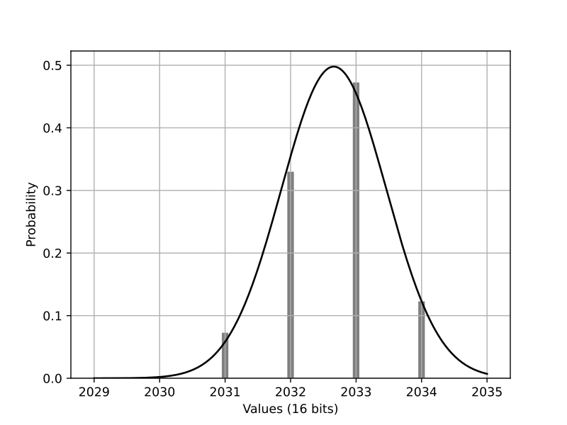
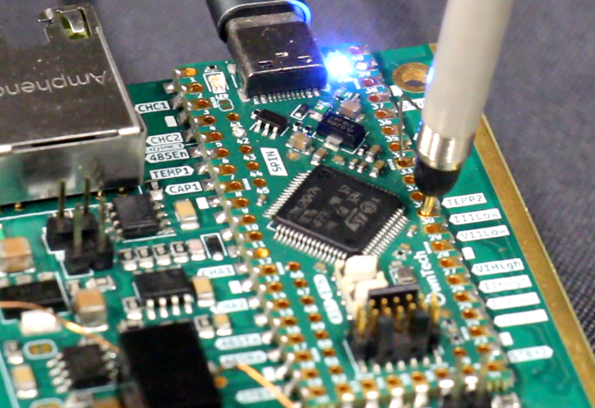
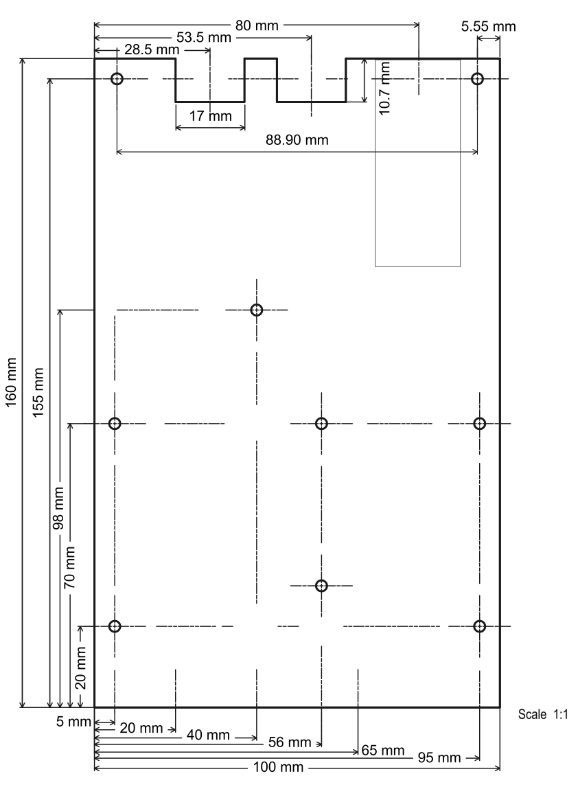

# Twist Board Datasheet v1.4.1

## Overview

The **Twist Board** is a reprogrammable, bi-directional **300W power converter**. It features a dual **12V to 72V low side** and a single **10V to 110V high side**. The maximum current per power channel is **8A**. The power channels can be used independently, providing two output voltages, or combined to double the current capacity.

The Twist Board is **fully open-source**, compatible with either the **SPIN board** or other programming systems. It supports communication via **CAN-bus** or **RS-485**.

!!! check "At a Glance"
    - **Rated Power:** 300W
    - **Number of Low-Side Channels:** 
        - Dual Low side
        - Single High side
    - **Current ratings:** 
        - 8A per channel
        - 16A in parallel
    - **Voltage Ratings:** 
        - 12V to 72V low-side
        - 12V to 100V high-side

!!! attention "Special Features"
    - **2-phase design**
    - **Dual or Single power channel configuration**
    - **Up to 97% efficiency**
    - **Standard size**: 100mm x 160mm x 35mm
    - **Wide voltage operating range**
    - **DC or AC operation**
    - **Parallel connection for higher power**
    - **CAN-bus and RS-485 communication compatible**
    - **Fully open-source**
    - **Voltage and current mode libraries available**
    - [Github Repository](https://github.com/owntech-foundation/TWIST)

---
## Converter Pinout

The TWIST converter pinout is shown in the image below.

{ align=center style="border-radius: 5px;" loading=lazy}

!!! info "Converter pins"
    !!!danger "Power Pins or feeder pins"
        - **Vhigh** is the high side voltage
        - **Vlow** is the low side voltage. There are two channels 1 and 2.
        - **GND** is the power GND 
        - **Feeder 6V** is the 6V output of the embedded feeder
        - **D6V** is the input of the digital +6V. You can feed it from an outside source.
        - **DGND** When feeding from an outside source, connect your ground on the pin next to D6V
    !!!success "Data Pins"
        - **CAN1 and CAN2** the two pins of the CANBus
        - **RS485 +/-** the two pins of the RS485 bus.
        - **Analog +/-** the two pins of the analog bus. 
        - **Sync I/0** the pin through which boards synchronize. It is the same pin for both master and slave operation.
        - **DGND** is the digital ground

---
## Electrical Specifications

### Absolute Maximum Ratings
!!! warning "Absolute Maximum Ratings"
    | Parameter                             | Min | Typ | Max | Unit |
    |-----------                            |-----|-----|-----|------|
    | _Low-Side Voltage_                    | - | - | 90 | VDC |
    | _High-Side Voltage_                   | 8 | - | 110 | VDC |
    | _Low-Side Peak Current per Channel_   | - | - | 10 | A |
    | _Power Output_                        | - | - | 300 | W |

### Low-Side Ratings
| Parameter | Min | Typ | Max | Unit |
|-----------|-----|-----|-----|------|
| *Number of Power Channels* | - | - | 2 | - |
| *Voltage Range* | 12 | - | 72 | VDC |
| *(Max Low-Side Peak Current per Channel)* | - | - | 8 | A |
| *Voltage Ripple* | - | - | 0.3 | VDC |

### High-Side Ratings
| Parameter | Min | Typ | Max | Unit |
|-----------|-----|-----|-----|------|
| *Number of Power Channels* | - | - | 1 | - |
| *Voltage Range* | 12 | - | 100 | VDC |
| *Voltage Ripple* | - | - | 0.3 | VDC |

### Switching Characteristics
| Parameter | Min | Typ | Max | Unit |
|-----------|-----|-----|-----|------|
| *Switching Frequency* | - | 200 | - | kHz |
| *Selectable Deadtime (20kΩ resistor)* | - | 200 | - | ns |
| *Maximum Gate Current* | - | 4 | - | A |

### Temperature and Dimensions
| Parameter | Min | Typ | Max | Unit |
|-----------|-----|-----|-----|------|
| *Operating Temperature* | -20 | - | +60 | °C |
| *Cooling Principle* | - | Natural Convection | - | - |
| *Dimensions (L x W x H)* | - | 160 x 100 x 35 | - | mm |

### Protection Features
| Parameter | Min | Typ | Max | Unit |
|-----------|-----|-----|-----|------|
| *High-Side Fuse (Tamb = 25°C)* | - | 8 | - | A |
| *Low-Side Fuse (Tamb = 25°C)* | - | 8 | - | A |

---
## Communication Specifications

### CAN-FD
| Type | Parameter | Min | Typ | Max | Unit |
| ------ |-----------|-----|-----|-----|------|
| *CAN-FD* |  Baudrate | 500 | 500 | - | kBauds |
| *Half Duplex RS485* | Baudrate | 10 | 20 | - | MBauds |
| *SPI* | Baudrate | 0.5 | - | 20 | MBauds |
| *USART* | Baudrate | - | 115200 | - | Bauds |

---
## Synchronization

Two Twist Boards can be synchronized via **PWM sinc IN/OUT**. Using a S-FTP RJ45 cable, the delay and jitter between the server and the client PWM are measured as follows:

| Parameter | Symbol | Min | Typ | Max | Unit |
|-----------|--------|-----|-----|-----|------|
| *PWM Slew Rate* | - | 660 | - | - | mV/ns |
| *Delay Between Server and Client* | td | - | 24.2 | - | ns |
| *Jitter of PWM Client* | tj | - | 4.8 | - | ns |

Data obtained with a 15cm S-FTP cable.

---
## Analog Communication

Analog communication between boards allows voltage and current measurement with **high accuracy**.

**Example Measurement:**
- A **16-bit value** of **2000** is transmitted by a server board.
- Step response from **1V to 1.25V** measured with a **500 MHz oscilloscope**.

| Parameter | Symbol | Min | Typ | Max | Unit |
|-----------|--------|-----|-----|-----|------|
| *Step Response Time to ±5%* | Δt5% | - | 1.7 | - | µs |
| *Steady-State Value* | Vfinal | - | 1.25 | - | V |
| *±5% Steady-State Interval* | ΔV | - | 0.125 | - | V |
| *Bandwidth* | $fc = \dfrac{3}{2\cdot \pi \cdot \Delta t_{5\%}}$ | - | 281 | - | kHz |

Statistical Distribution of 10235 data samples 

| Parameter | Symbol | Min | Typ | Max | Unit |
|-----------|--------|-----|-----|-----|------|
| Mean | $\mu$ | - | 2032.65 | - |  |
| Variance | $\sigma^2$ |  | 0.795 | - |  |

---
## Measurement Chains

The Twist Board implements full observability on all **low-side** and **high-side** power channels using **isolated measurements**.

### ADC Specifications

| Parameter | Value |
|-----------|-------|
| ADC Technology | Successive Approximation (SAR) |
| Independent ADC Peripherals | 5 |
| Number of Channels per ADC | 1 to 6 |
| Sampling Time | 530 ns |
| Hardware ADC Trigger | Programmable trigger instant on PWM period |
| Number of PWM synchronized ADCs | 2 |
| Software ADC Trigger | All ADC peripherals |
| Trigger Event Typical Frequency | 200 kHz |

### Measurement Points

| Measurement | Description | Sensor Technology | Bandwidth (kHz) | Signal Side Amplitude | Full Scale Range | Unit |
|-------------|-------------|--------------------|----------------|-------------|-----------| ---- |
| VILow1 | Low-side voltage | Voltage divider & isolation amplifier | 60 | ±250 mV | ±80 | V |
| iILow1 | Low-side current | Isolated Hall effect sensor | 1000 | ±20 A | ±10 | A |
| VILow2 | Low-side voltage | Voltage divider & isolation amplifier | 60 | ±250 mV | ±80 | V |
| iILow2 | Low-side current | Isolated Hall effect sensor | 1000 | ±20 A | ±10 | A |
| VIHigh | High-side voltage | Voltage divider & isolation amplifier | 100 | +2 V | 120 | V |
| iIHigh | High-side current | Isolated Hall effect sensor | 1000 | ±20 A | ±20 | A |
| Temp1 | LEG1 Temperature | NTC Thermistor |  |  | -40 to +110  | $\degree C$ |
| Temp2 | LEG2 Temperature | NTC Thermistor |  |  | -40 to +110  | $\degree C$ |

Schematic showing where the measurements are performed on the circuit.

!!! info "Measurements location and output convention"
    - **Voltage sensors** - they are connected at the input/output of the TWIST board
    - **Low-side Current sensors** - they are connected right next to the inductor and measure inductor current. 
        Their output is *positive* when the converter is in **BUCK mode (current going OUT of the low side)**. 
    - **High-side Current sensor** - it is connected right next to the high side connector.
        Its output is *positive* when the converter is in **BUCK mode (current going IN of the high side)**. 

Image showing where the measurements can be accessed on the board. 

!!! note "Measurement pins"
    All measurements have pins which can be easily accessed with a probe (oscilloscope or multimeter) as shown below.

    !!!warning Use ground springs for noise reduction

    
    
     

### Standard Deviation of Measurements

| Parameter | Not Averaged | Avg of 2 Measures | Avg of 3 Measures | Avg of 5 Measures | Avg of 10 Measures |
|-----------|-------------|-------------------|-------------------|-------------------|--------------------|
| VILow1 | 85 mV | 61 mV | 50 mV | 39 mV | 28 mV |
| VILow2 | 82 mV | 58 mV | 47 mV | 37 mV | 27 mV |
| VIHigh | 150 mV | 108 mV | 88 mV | 68 mV | 48 mV |
| IILow1 | 34 mA | 24 mA | 20 mA | 16 mA | 11 mA |
| IILow2 | 34 mA | 24 mA | 20 mA | 15 mA | 11 mA |
| IIHigh | 14 mA | 10 mA | 8 mA | 6 mA | 4 mA |

### Relative accuracy of voltage and current measurements

The following graphs give the accuracy of the voltage and current measurements for different levels of current and voltage.

### Theoretical Calibration Parameters

By default all TWIST boards can be calibrated using the following parameters.

| Variable Name | Gain     | Offset   | Unit  |
|--------------|---------|----------|------|
| VLow1        | 0.045   | -94.364  | V    |
| VLow2        | 0.045   | -94.364  | V    |
| VHigh        | 0.029964 | 0       | V    |
| ILow1        | 0.005   | -10      | A    |
| ILow2        | 0.005   | -10      | A    |
| IHigh        | 0.005   | -10      | A    |

---

## Typical Applications

| Mode Name | High Side | Low Side | Electrolytic Capacitor | Typical Application |
|-----------|----------|---------|----------------------|--------------------|
| DC-DC Buck | Input | Output | ON | Battery Charger |
| DC-DC Independent | Input | Output | ON | Reprogrammable Power Supply |
| DC-DC Boost | Output | Input | ON | Fuel-Cell Converter |
| 1-Phase DC-AC Buck Inverter | Input | Output | OFF | AC Micro-Grids |
| 1-Phase DC-AC Buck PFC | Input | Output | OFF | AC Micro-Grids |

### Example wiring diagram and schematic of the Twist board in Buck mode 

### Example wiring diagram and schematic of the Twist board in Independent mode 

### Example wiring diagram and schematic of the Twist board in Boost mode 

### Example wiring diagram and schematic of the Twist board in Boost mode 

### Example wiring diagram and schematic of the Twist board in PFC mode

!!!warning The AC source shown below must be low-voltage (below 90V peak)

---

## Mechanical Specifications

Below is the Twist converter assembly view.

---
## Revision History

| Date | Revision | Changes |
|------|----------|---------|
| 07-Fev-2025 | 1 | Initial Release |

**License:** Documentation licensed under Creative Commons SA-BY

